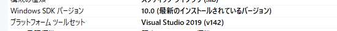

# foo_input_mucom

mucom88 .muc .mub component for foobar2000

##  使用方法と注意点

### インストール

foobar2000のcomponentsフォルダにdllをコピーしてください。

### 注意点

曲タグとプレイリスト秒数は初回ファイル読み込み時の情報がキャッシュされます。

キャッシュされたタグは
```
 Property>Tools>Reload Info
```
で更新できます。

## コンパイル方法

* foobar2000 SDKの準備
```
foobar2000ディレクトリの
SDK, shared, helpers
などがあるディレクトリにmucom88とfoo_input_mucomのディレクトリを置きます。

```

* mucom_libの「Windows SDKバージョン」と「プラットフォームツールセット」を変更する



* foo_input_mucom.slnを開いてビルドする

## ライセンス

プラグイン用のソースコード部分にはMUCOM88 for Windowsと同じライセンスが適用されるものとします。(SDK部分は除く)

* [README.md](mucom_doc/README.md)
* [README-en.md](mucom_doc/README-en.md)
* [LICENSE](mucom_doc/LICENSE)

# 参考ソースコード
foo_input_raw
https://github.com/dofuuz/foo_input_raw